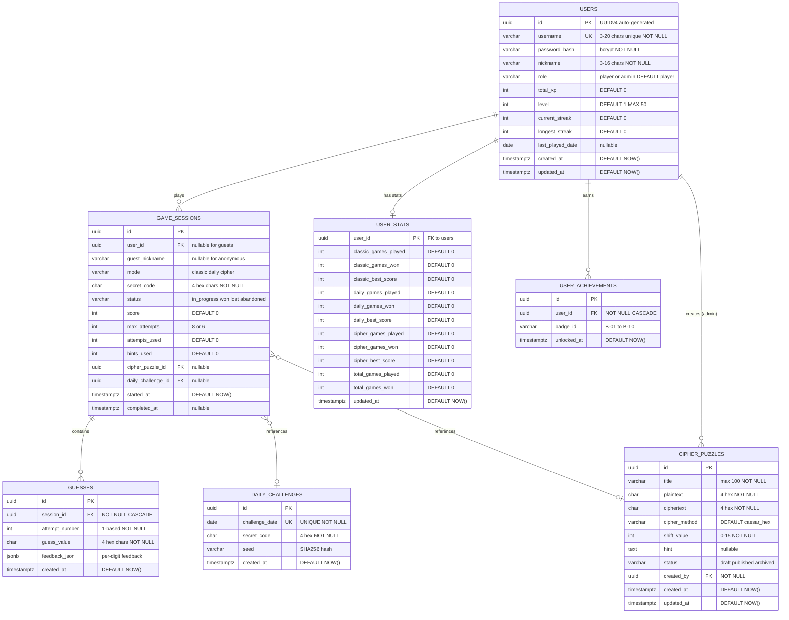

# 🗃️ Database Design — Code Breaker

> **Standar**: IEEE 1016 (Data Design) | **DBMS**: PostgreSQL 14+ | **ORM**: Prisma | **Tanggal**: 17 April 2026

---

## 1. Entity Relationship Diagram (ERD)



---

## 2. Kamus Data

### 2.1 `users`

| Kolom           | Tipe          | Constraint                        | Deskripsi                        |
|-----------------|---------------|-----------------------------------|----------------------------------|
| id              | UUID          | PK, DEFAULT gen_random_uuid()     | Identifier unik                  |
| username        | VARCHAR(20)   | UNIQUE, NOT NULL                  | Login username                   |
| password_hash   | VARCHAR(255)  | NOT NULL                          | bcrypt hash (cost≥10)            |
| nickname        | VARCHAR(16)   | NOT NULL                          | Display name                     |
| role            | VARCHAR(10)   | NOT NULL, DEFAULT 'player'        | 'player' atau 'admin'            |
| total_xp        | INTEGER       | NOT NULL, DEFAULT 0               | XP kumulatif                     |
| level           | INTEGER       | NOT NULL, DEFAULT 1, CHECK(1-50)  | floor(xp/1000)+1                 |
| current_streak  | INTEGER       | NOT NULL, DEFAULT 0               | Hari berturut-turut main         |
| longest_streak  | INTEGER       | NOT NULL, DEFAULT 0               | Record streak terpanjang         |
| last_played_date| DATE          | NULLABLE                          | Tanggal terakhir main            |
| created_at      | TIMESTAMPTZ   | NOT NULL, DEFAULT NOW()           | Timestamp registrasi             |
| updated_at      | TIMESTAMPTZ   | NOT NULL, DEFAULT NOW()           | Timestamp update terakhir        |

### 2.2 `game_sessions`

| Kolom             | Tipe        | Constraint                       | Deskripsi                               |
|-------------------|-------------|----------------------------------|-----------------------------------------|
| id                | UUID        | PK                               | Session ID                              |
| user_id           | UUID        | FK→users.id, NULLABLE            | NULL jika guest                         |
| guest_nickname    | VARCHAR(16) | NULLABLE                         | Nickname guest (jika user_id NULL)      |
| mode              | VARCHAR(10) | NOT NULL                         | classic, daily, cipher                  |
| secret_code       | CHAR(4)     | NOT NULL                         | Kode rahasia (TIDAK ke client)          |
| status            | VARCHAR(15) | NOT NULL, DEFAULT 'in_progress'  | in_progress, won, lost, abandoned       |
| score             | INTEGER     | NOT NULL, DEFAULT 0              | Skor akhir                              |
| max_attempts      | INTEGER     | NOT NULL                         | 8 (classic/daily), 6 (cipher)           |
| attempts_used     | INTEGER     | NOT NULL, DEFAULT 0              | Percobaan digunakan                     |
| hints_used        | INTEGER     | NOT NULL, DEFAULT 0              | Hint digunakan (cipher)                 |
| cipher_puzzle_id  | UUID        | FK→cipher_puzzles.id, NULLABLE   | Ref puzzle (cipher only)                |
| daily_challenge_id| UUID        | FK→daily_challenges.id, NULLABLE | Ref daily challenge                     |
| started_at        | TIMESTAMPTZ | NOT NULL, DEFAULT NOW()          | Waktu mulai                             |
| completed_at      | TIMESTAMPTZ | NULLABLE                         | Waktu selesai                           |

**CHECK**: `(user_id IS NOT NULL AND guest_nickname IS NULL) OR (user_id IS NULL AND guest_nickname IS NOT NULL)`

### 2.3 `guesses`

| Kolom          | Tipe     | Constraint                             | Deskripsi               |
|----------------|----------|----------------------------------------|-------------------------|
| id             | UUID     | PK                                     | Guess ID                |
| session_id     | UUID     | FK→game_sessions.id, CASCADE, NOT NULL | Sesi terkait            |
| attempt_number | INTEGER  | NOT NULL, CHECK(>0)                    | Nomor percobaan         |
| guess_value    | CHAR(4)  | NOT NULL                               | Tebakan hex (uppercase) |
| feedback_json  | JSONB    | NOT NULL                               | Feedback per digit      |
| created_at     | TIMESTAMPTZ | NOT NULL, DEFAULT NOW()             | Timestamp               |

**UNIQUE**: `(session_id, attempt_number)`

**feedback_json format**:
```json
[
  {"position": 0, "digit": "A", "status": "correct"},
  {"position": 1, "digit": "3", "status": "misplaced"},
  {"position": 2, "digit": "F", "status": "wrong"},
  {"position": 3, "digit": "1", "status": "correct"}
]
```

### 2.4 `daily_challenges`

| Kolom          | Tipe     | Constraint          | Deskripsi                          |
|----------------|----------|---------------------|------------------------------------|
| id             | UUID     | PK                  | Challenge ID                       |
| challenge_date | DATE     | UNIQUE, NOT NULL    | 1 per hari                         |
| secret_code    | CHAR(4)  | NOT NULL            | Kode hex                           |
| seed           | VARCHAR(64)| NOT NULL          | SHA256(date + app_secret)          |
| created_at     | TIMESTAMPTZ | DEFAULT NOW()    | Timestamp                          |

### 2.5 `cipher_puzzles`

| Kolom         | Tipe        | Constraint              | Deskripsi                     |
|---------------|-------------|-------------------------|-------------------------------|
| id            | UUID        | PK                      | Puzzle ID                     |
| title         | VARCHAR(100)| NOT NULL                | Judul puzzle                  |
| plaintext     | CHAR(4)     | NOT NULL                | Jawaban asli hex              |
| ciphertext    | CHAR(4)     | NOT NULL                | Hasil enkripsi                |
| cipher_method | VARCHAR(20) | DEFAULT 'caesar_hex'    | Metode enkripsi               |
| shift_value   | INTEGER     | NOT NULL, CHECK(0-15)   | Caesar shift                  |
| hint          | TEXT        | NULLABLE                | Petunjuk opsional             |
| status        | VARCHAR(10) | DEFAULT 'draft'         | draft, published, archived    |
| created_by    | UUID        | FK→users.id, NOT NULL   | Admin pembuat                 |
| created_at    | TIMESTAMPTZ | DEFAULT NOW()           | Timestamp                     |
| updated_at    | TIMESTAMPTZ | DEFAULT NOW()           | Timestamp                     |

### 2.6 `user_achievements` — UNIQUE(user_id, badge_id)

### 2.7 `user_stats` — PK = user_id (FK→users.id, 1:1)

---

## 3. Indexing Strategy

| Index                          | Tabel          | Kolom               | Alasan                       |
|--------------------------------|----------------|----------------------|------------------------------|
| idx_users_username             | users          | username (UNIQUE)    | Login lookup                 |
| idx_sessions_user_id           | game_sessions  | user_id              | Riwayat per user             |
| idx_sessions_mode_score        | game_sessions  | mode, score DESC     | Leaderboard query            |
| idx_sessions_daily             | game_sessions  | user_id, daily_challenge_id | Daily completion check |
| idx_guesses_session            | guesses        | session_id           | Fetch guesses per session    |
| idx_daily_date                 | daily_challenges| challenge_date (UQ) | Lookup by date               |
| idx_puzzles_status             | cipher_puzzles | status               | Filter published             |
| idx_achievements_user          | user_achievements| user_id            | Badges per user              |

---

## 4. Migration & Rollback Strategy

### 4.1 Tool & Convention
- **Tool**: Prisma Migrate
- **Naming**: `YYYYMMDDHHMMSS_descriptive_name`

### 4.2 Migration Order

| Order | File                                     | Operasi                        |
|-------|------------------------------------------|--------------------------------|
| 1     | `20260417120000_create_users`            | CREATE TABLE users + indexes   |
| 2     | `20260417120001_create_user_stats`       | CREATE TABLE user_stats + FK   |
| 3     | `20260417120002_create_daily_challenges` | CREATE TABLE + index           |
| 4     | `20260417120003_create_cipher_puzzles`   | CREATE TABLE + FK/idx          |
| 5     | `20260417120004_create_game_sessions`    | CREATE TABLE + FKs/idx         |
| 6     | `20260417120005_create_guesses`          | CREATE TABLE + FK/idx          |
| 7     | `20260417120006_create_user_achievements`| CREATE TABLE + idx             |
| 8     | `20260417120007_seed_admin`              | INSERT admin (hashed pw)       |

### 4.3 Rollback Rules

- Setiap migration **WAJIB** punya script `down` (DROP/ALTER reverse).
- Backup database **SEBELUM** migration di production.
- Migration dijalankan dalam **transaction**.
- Verify row count + data integrity setelah migration.

> **Status: DRAFT — Siap untuk Review**
