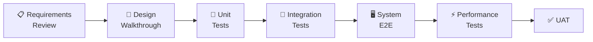
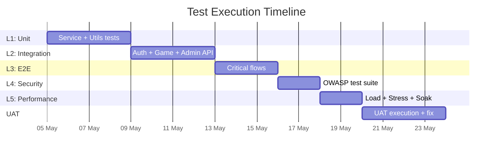

# 🧪 Master Test Plan — Code Breaker

> **Standar**: IEEE 829 | **Versi**: 1.0 | **Tanggal**: 17 April 2026 | **Ref**: SRS v1.0, SLA/SLO v1.0

---

## 1. Test Strategy (Shift-Left)



### Test Levels

| Level | Tipe            | Tool             | Cakupan Target                  |
|-------|-----------------|------------------|---------------------------------|
| L1    | Unit Test       | Jest             | ≥80% line coverage (services)   |
| L2    | Integration Test| Jest + Supertest | Semua API endpoint              |
| L3    | System / E2E    | Playwright       | Critical user flows             |
| L4    | Security Test   | Manual + ZAP     | OWASP Top 10 checklist          |
| L5    | Performance Test| k6               | SLA/SLO compliance              |

---

## 2. Test Cases — Unit (L1)

### FeedbackEngine

| TC ID    | Test Case                                 | Input                    | Expected                               |
|----------|-------------------------------------------|--------------------------|----------------------------------------|
| UT-FE-01 | All correct                               | secret=A3F1, guess=A3F1  | [correct×4]                            |
| UT-FE-02 | All wrong                                 | secret=A3F1, guess=B240  | [wrong×4]                              |
| UT-FE-03 | Mixed (correct+misplaced+wrong)           | secret=A3F1, guess=A1B3  | [correct, misplaced, wrong, misplaced] |
| UT-FE-04 | Duplicate digit handling                  | secret=AABB, guess=ABBA  | [correct, misplaced, misplaced, correct]|
| UT-FE-05 | Case insensitive                          | secret=A3F1, guess=a3f1  | [correct×4]                            |
| UT-FE-06 | Cipher mode (match/no-match)              | secret=A3F1, guess=A2F0  | [match, no-match, match, no-match]     |

### ScoreCalculator

| TC ID    | Test Case                     | Input              | Expected |
|----------|-------------------------------|---------------------|----------|
| UT-SC-01 | Perfect score (attempt 1)     | attempts=1, max=8   | 800      |
| UT-SC-02 | Min score (attempt 8)         | attempts=8, max=8   | 100      |
| UT-SC-03 | Cipher mode (max=6)           | attempts=1, max=6   | 600      |
| UT-SC-04 | Hint penalty (1 hint)         | score=600, hints=1  | 300      |
| UT-SC-05 | Loss                          | status=lost         | 0        |

### AuthService

| TC ID    | Test Case                     | Expected                         |
|----------|-------------------------------|----------------------------------|
| UT-AS-01 | Register valid data           | User created, JWT returned       |
| UT-AS-02 | Register duplicate username   | Error: username taken            |
| UT-AS-03 | Login correct credentials     | JWT access + refresh token       |
| UT-AS-04 | Login wrong password          | Error: invalid credentials       |
| UT-AS-05 | Password hash is bcrypt       | Hash starts with `$2b$`          |

### Input Validation

| TC ID    | Test Case                     | Input             | Expected              |
|----------|-------------------------------|--------------------|-----------------------|
| UT-IV-01 | Valid hex guess                | `A3F1`            | Pass                  |
| UT-IV-02 | Too short                     | `A3F`             | Fail: must be 4 chars |
| UT-IV-03 | Invalid char                  | `G3F1`            | Fail: invalid hex     |
| UT-IV-04 | Nickname with XSS             | `<script>`        | Fail: alphanumeric    |
| UT-IV-05 | SQL injection username        | `'; DROP TABLE--` | Fail: invalid format  |

---

## 3. Test Cases — Integration (L2)

### Auth API

| TC ID    | Endpoint                      | Expected Status |
|----------|-------------------------------|-----------------|
| IT-AU-01 | POST /auth/register (valid)   | 201 Created     |
| IT-AU-02 | POST /auth/register (dupe)    | 409 Conflict    |
| IT-AU-03 | POST /auth/login (valid)      | 200 + token     |
| IT-AU-04 | POST /auth/login (invalid)    | 401             |
| IT-AU-05 | POST /auth/login (6th in 1min)| 429 Too Many    |
| IT-AU-06 | GET /profile (no token)       | 401             |
| IT-AU-07 | GET /profile (expired token)  | 401             |

### Game API

| TC ID    | Endpoint                          | Expected                    |
|----------|-----------------------------------|-----------------------------|
| IT-GM-01 | POST /games/start {classic}       | 201 + sessionId             |
| IT-GM-02 | POST /games/:id/guess (valid)     | 200 + feedback              |
| IT-GM-03 | POST /games/:id/guess (invalid)   | 400 Validation Error        |
| IT-GM-04 | POST /games/:id/guess (game over) | 400 Bad Request             |
| IT-GM-05 | Win game → correct score          | status:won + correct score  |
| IT-GM-06 | Response has NO secretCode field  | No leakage                  |
| IT-GM-07 | Daily: same code same date        | Deterministic               |
| IT-GM-08 | Daily: reject 2nd attempt (reg)   | 400 already completed       |

### Admin API

| TC ID    | Endpoint                          | Expected             |
|----------|-----------------------------------|----------------------|
| IT-AD-01 | POST /admin/puzzles (admin)       | 201                  |
| IT-AD-02 | POST /admin/puzzles (player)      | 403 Forbidden        |
| IT-AD-03 | POST /admin/puzzles (no auth)     | 401                  |
| IT-AD-04 | PATCH status draft→published      | 200                  |
| IT-AD-05 | PATCH status archived→published   | 400 rejected         |

---

## 4. Test Cases — E2E (L3)

| TC ID  | Flow                                                            | Priority |
|--------|-----------------------------------------------------------------|----------|
| E2E-01 | Guest: nickname → Classic → play → result                      | Critical |
| E2E-02 | Register → Login → Classic (win) → Profile shows XP/score     | Critical |
| E2E-03 | Login → Daily Challenge → complete → reject replay             | High     |
| E2E-04 | Login → Cipher Crack → use hint → complete                    | High     |
| E2E-05 | Admin: login → create puzzle → publish → verify playable       | Critical |
| E2E-06 | Leaderboard shows scores sorted after games                    | High     |
| E2E-07 | Logout clears session → redirect to login                      | High     |

---

## 5. Test Cases — Security (L4)

| TC ID | Test                                   | Expected              | OWASP |
|-------|----------------------------------------|------------------------|-------|
| ST-01 | SQL injection via guess                | 400 validation error   | A03   |
| ST-02 | XSS via nickname                       | Sanitized/rejected     | A03   |
| ST-03 | Password stored as bcrypt (not plain)  | Hash `$2b$...` in DB   | A07   |
| ST-04 | Secret code NOT in response            | No secretCode field    | A01   |
| ST-05 | Player → admin endpoint                | 403 Forbidden          | A01   |
| ST-06 | CORS rejects unauthorized origin       | CORS error             | A05   |
| ST-07 | Rate limit blocks brute force          | 429 on 6th attempt     | A07   |
| ST-08 | Security headers present               | X-Frame, HSTS, etc.   | A05   |
| ST-09 | .env NOT in git                        | Not tracked            | A05   |
| ST-10 | Error response has no stack trace      | Generic message        | A05   |

---

## 6. Performance Test Plan (L5)

### 6.1 SLO Targets

| SLO    | Target         | Verification                  |
|--------|----------------|-------------------------------|
| SLO-01 | P95 ≤ 500ms    | k6: measure P95 per endpoint  |
| SLO-02 | Uptime ≥ 99%   | Soak test: 1 hour sustained   |
| SLO-03 | Error ≤ 1%     | k6: count 5xx responses       |
| SLO-04 | 20 CCU         | k6: 20 virtual users          |

### 6.2 Scenarios

| PT ID | Scenario        | VUs | Duration | Target                   |
|-------|-----------------|-----|----------|--------------------------|
| PT-01 | Baseline Load   | 10  | 5 min    | P95 ≤ 300ms, 0% error   |
| PT-02 | Target Load     | 20  | 5 min    | P95 ≤ 500ms, ≤1% error  |
| PT-03 | Stress Test     | 50  | 3 min    | System should not crash  |
| PT-04 | Soak Test       | 15  | 60 min   | No memory leaks, stable  |

### 6.3 k6 Script Template

```javascript
import http from 'k6/http';
import { check, sleep } from 'k6';

export const options = {
  scenarios: {
    target_load: { executor: 'constant-vus', vus: 20, duration: '5m' },
  },
  thresholds: {
    http_req_duration: ['p(95)<500'], // SLO-01
    http_req_failed: ['rate<0.01'],   // SLO-03
  },
};

const BASE = __ENV.BASE_URL || 'http://localhost:3000/api/v1';

export default function () {
  // Start game
  const start = http.post(`${BASE}/games/start`,
    JSON.stringify({ mode: 'classic' }),
    { headers: { 'Content-Type': 'application/json' } }
  );
  check(start, { 'game started': r => r.status === 201 });
  if (start.status !== 201) return;
  const sid = JSON.parse(start.body).data.sessionId;

  // Submit guesses
  for (const g of ['A3F1', 'B240', 'C567']) {
    const res = http.post(`${BASE}/games/${sid}/guess`,
      JSON.stringify({ guess: g }),
      { headers: { 'Content-Type': 'application/json' } }
    );
    check(res, { 'guess ok': r => r.status === 200 });
    sleep(0.5);
  }

  // Leaderboard
  const lb = http.get(`${BASE}/leaderboard/classic`);
  check(lb, { 'lb ok': r => r.status === 200 });
  sleep(1);
}
```

---

## 7. Entry & Exit Criteria

### Entry per Level

| Level       | Entry                                          |
|-------------|------------------------------------------------|
| Unit        | Code implemented. Test env ready.              |
| Integration | Unit tests ≥80%. API endpoints ready.          |
| E2E         | Integration pass. Frontend+backend on staging. |
| Security    | System tests pass critical flows.              |
| Performance | System stable on staging. Data seeded.         |

### Exit (Overall)

| Kriteria                    | Target          |
|-----------------------------|-----------------|
| Unit coverage               | ≥ 80%           |
| Integration pass rate       | 100%            |
| E2E critical flows          | 100% pass       |
| Security tests              | 100% pass       |
| Performance SLO compliance  | All met at 20VU |
| Open Critical/High bugs     | 0               |

---

## 8. Defect Classification

| Severity | Definisi                          | Response  | Resolution |
|----------|-----------------------------------|-----------|------------|
| **S1**   | System crash, security breach     | ≤ 1 jam   | ≤ 4 jam    |
| **S2**   | Core feature broken, no workaround| ≤ 4 jam   | ≤ 1 hari   |
| **S3**   | Non-core broken, workaround exists| ≤ 1 hari  | ≤ 3 hari   |
| **S4**   | Cosmetic, typo, minor UI         | ≤ 3 hari  | Next cycle |

---

## 9. Test Schedule



> **Status: DRAFT — Siap untuk Review**
