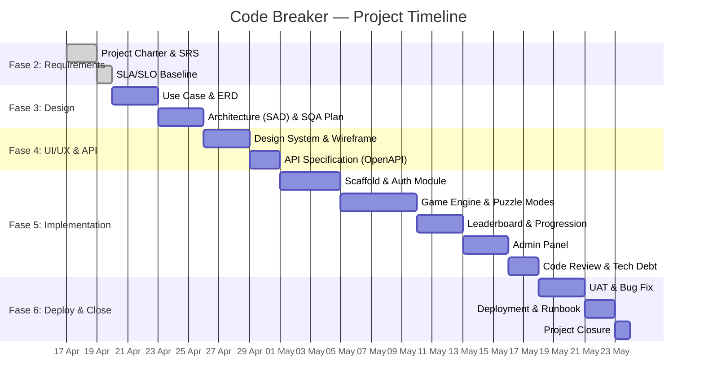

# 📜 Project Charter — Code Breaker

| Field             | Detail                                    |
|-------------------|-------------------------------------------|
| **Nama Proyek**   | Code Breaker                              |
| **Versi Dokumen** | 1.0                                       |
| **Tanggal**       | 17 April 2026                             |
| **Status**        | Draft — Menunggu Persetujuan Stakeholder  |

---

## 1. Latar Belakang & Tujuan

Code Breaker adalah **web-based puzzle game** yang menantang pemain untuk menebak kode heksadesimal 4-digit (0000–FFFF). Terinspirasi dari mekanisme Wordle, sistem memberikan feedback visual per digit setiap percobaan dan menghitung skor berdasarkan efisiensi tebakan.

**Tujuan Bisnis:**
- Menyediakan platform hiburan edukatif yang melatih logika dan pengenalan sistem bilangan heksadesimal.
- Fondasi teknis modular untuk pengembangan mode puzzle tambahan di masa depan.

**Tujuan Teknis:**
- Implementasi arsitektur **React + Node.js + PostgreSQL** yang clean, secure, dan maintainable.
- Menerapkan prinsip **Security by Design** (OWASP Top 10).

---

## 2. Ruang Lingkup (Scope)

### 2.1 In-Scope

| # | Fitur                                | Deskripsi                                                         |
|---|---------------------------------------|-------------------------------------------------------------------|
| 1 | **Hex Code Guessing (Classic Mode)** | Tebak kode hex 4-digit. Feedback: posisi benar, digit benar salah posisi, salah total. Maks 8 percobaan. |
| 2 | **Daily Challenge Mode**             | Satu puzzle unik per hari, semua pemain mendapat kode yang sama. Seed deterministik. |
| 3 | **Cipher Crack Mode**                | Pecahkan pesan yang di-encode dengan Caesar cipher pada domain hex (0-F). |
| 4 | **Sistem Skor & Leaderboard Lokal**  | Skor dihitung dari jumlah percobaan. Leaderboard per-mode (server-side). |
| 5 | **Sistem Progres Pemain**            | Level, XP, badge/achievement, dan daily streak tracking.           |
| 6 | **Anonymous Play**                   | Mainkan langsung dengan memasukkan nickname tanpa registrasi.      |
| 7 | **Registrasi Opsional**              | Username + password. UID di-generate oleh sistem (UUIDv4).         |
| 8 | **Admin Panel — Puzzle Management**  | Admin membuat, mengedit, dan mengarsipkan konten puzzle Cipher Crack. |
| 9 | **Responsive Web UI**                | Desktop & mobile browser. Web-only.                                |

### 2.2 Out-of-Scope

| Item                        | Alasan                                       |
|-----------------------------|----------------------------------------------|
| Multiplayer real-time       | Tidak dibutuhkan per keputusan stakeholder.   |
| OAuth / SSO Integration    | Auth cukup username + password lokal.         |
| Payment / Premium features  | Tidak ada monetisasi.                        |
| Mobile native app           | Web-only.                                    |
| Anti-cheat engine           | Tidak diprioritaskan.                        |
| Notifikasi email/push       | Tidak ada integrasi pihak ketiga.            |

---

## 3. Stakeholder

| Role              | Tanggung Jawab                                             |
|-------------------|------------------------------------------------------------|
| **Product Owner** | Menentukan prioritas fitur, menyetujui deliverable.        |
| **Developer**     | Implementasi frontend, backend, database.                  |
| **Admin (User)**  | Mengelola konten puzzle melalui admin panel.                |
| **Player (User)** | Pengguna akhir yang memainkan game.                        |
| **SQA**           | Menyusun test plan, menjalankan pengujian.                  |

---

## 4. Milestone & Timeline

| Milestone                   | Target       | Kriteria Selesai                                    |
|-----------------------------|--------------|-----------------------------------------------------|
| M1: Requirements Approved   | Akhir Fase 2 | Charter, SRS, SLA/SLO di-sign-off.                 |
| M2: Design Complete         | Akhir Fase 3 | UC, ERD, SAD, SQA Plan approved.                    |
| M3: UI/API Spec Ready       | Akhir Fase 4 | Wireframe + OpenAPI spec approved.                  |
| M4: Core Game Playable      | Mid Fase 5   | Classic Mode + Daily Challenge end-to-end.          |
| M5: Feature Complete        | Akhir Fase 5 | Semua fitur in-scope ter-implementasi.              |
| M6: UAT Passed              | Mid Fase 6   | ≥95% test case lulus, zero critical bugs.           |
| M7: Production Release      | Akhir Fase 6 | Sistem live, runbook tersedia, handover selesai.    |

---

## 5. Risk Register

| ID   | Risiko                                       | Prob.  | Dampak | Mitigasi                                                      |
|------|----------------------------------------------|--------|--------|---------------------------------------------------------------|
| R-01 | Kebocoran password (plaintext)               | Rendah | Tinggi | Wajib bcrypt/argon2 hashing. Security review di Gate 3.       |
| R-02 | Manipulasi skor dari client-side             | Sedang | Sedang | Validasi skor 100% di server-side; kode tidak dikirim ke client. |
| R-03 | SQL Injection pada input guess/nickname      | Rendah | Tinggi | Prepared statements (ORM). Input sanitization.                |
| R-04 | Scope creep (mode game tak terkendali)       | Sedang | Sedang | Scope lock setelah M1. Change request formal.                 |
| R-05 | Performa leaderboard lambat                  | Rendah | Rendah | Indexing kolom skor. Pagination. Query optimization.          |
| R-06 | Keterlambatan (single developer)             | Sedang | Tinggi | Prioritas fitur inti di sprint awal. MVP-first approach.      |
| R-07 | Downtime tanpa rollback plan                 | Rendah | Tinggi | Rollback procedure terdokumentasi.                            |

---

## 6. Asumsi & Batasan

**Asumsi:** Server deployment tersedia (VPS/cloud). PostgreSQL 14+. Node.js 18 LTS. Browser target: Chrome, Firefox, Edge, Safari (2 versi terbaru).

**Batasan:** Tim kecil (1–2 developer). Concurrent users maks 20. Tidak ada budget layanan cloud premium.

---

## 7. Kriteria Keberhasilan

| Kriteria                            | Target              |
|-------------------------------------|----------------------|
| Semua fitur in-scope berfungsi      | 100%                |
| UAT pass rate                       | ≥ 95%               |
| Zero critical/high severity bugs    | 0                   |
| P95 response time                   | ≤ 500ms             |
| Uptime bulan pertama                | ≥ 99%               |

> **Status: MENUNGGU PERSETUJUAN STAKEHOLDER**
