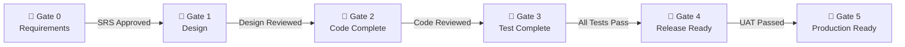
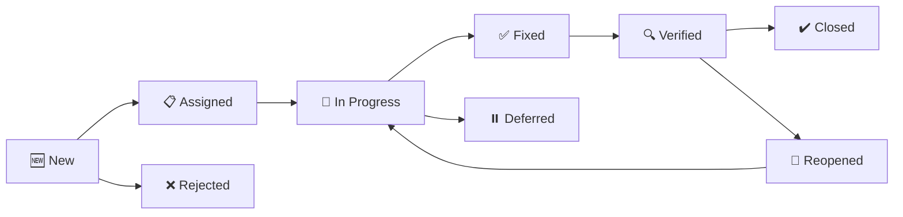
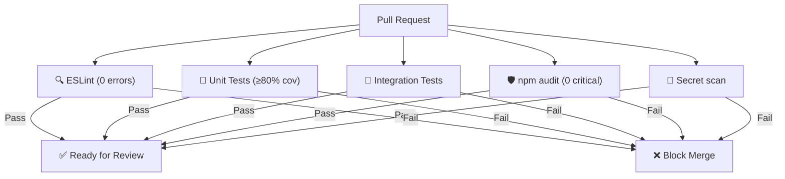

# 🛡️ SQA Plan — Code Breaker

> **Standar**: IEEE 730 | **Versi**: 1.0 | **Tanggal**: 17 April 2026 | **Ref**: SRS v1.0, Test Plan v1.0

---

## 1. Quality Gates



### Gate 0: Requirements

| Kriteria                                    | Wajib |
|---------------------------------------------|-------|
| SRS mencakup semua FR, NFR, SR              | ✅    |
| Setiap FR memiliki prioritas (MoSCoW)       | ✅    |
| Setiap FR testable (traceability matrix)    | ✅    |
| Project Charter approved                     | ✅    |
| SLA/SLO baseline ditetapkan                  | ✅    |

### Gate 1: Design

| Kriteria                                    | Wajib |
|---------------------------------------------|-------|
| Use Case Specification lengkap              | ✅    |
| ERD + Data Dictionary lengkap               | ✅    |
| SAD reviewed                                 | ✅    |
| STRIDE Threat Model documented              | ✅    |
| Master Test Plan ditetapkan                  | ✅    |
| SQA Plan ditetapkan                          | ✅    |

### Gate 2: Code Complete

| Kriteria                                    | Wajib |
|---------------------------------------------|-------|
| Semua Must Have features implemented        | ✅    |
| Unit test coverage ≥ 80%                    | ✅    |
| Zero ESLint errors (`npm run lint`)          | ✅    |
| No hardcoded secrets in code                 | ✅    |
| All queries use prepared statements          | ✅    |
| JSDoc on every public function               | ✅    |
| try/catch in every async service function   | ✅    |
| Structured logging on important operations  | ✅    |
| Code review completed & approved             | ✅    |
| Tech Debt items logged                       | ✅    |

### Gate 3: Test Complete

| Kriteria                                    | Wajib |
|---------------------------------------------|-------|
| Integration tests: 100% pass                | ✅    |
| E2E critical flows: 100% pass               | ✅    |
| Security tests: 100% pass (10/10)           | ✅    |
| Performance: P95≤500ms at 20 VU             | ✅    |
| Performance: Error rate ≤1%                  | ✅    |
| Zero open S1/S2 bugs                         | ✅    |
| Open S3 ≤ 3 (with workarounds)              | ✅    |

### Gate 4: Release Ready

| Kriteria                                    | Wajib |
|---------------------------------------------|-------|
| UAT pass rate ≥ 95%                          | ✅    |
| UAT sign-off from stakeholder/PO            | ✅    |
| Deployment document ready                    | ✅    |
| Rollback procedure tested on staging         | ✅    |
| Runbook operasional ready                    | ✅    |
| Admin default password changed               | ✅    |
| Backup verified restores correctly           | ✅    |

### Gate 5: Production Ready

| Kriteria                                    | Wajib |
|---------------------------------------------|-------|
| Deployment successful (health check: 200)   | ✅    |
| Smoke test passed (critical flows)           | ✅    |
| Monitoring active                            | ✅    |
| Backup cron running                          | ✅    |
| 30-min post-deploy monitoring: no anomalies | ✅    |

---

## 2. Definition of Done (DoD)

### Task Level
1. Kode implemented sesuai spec
2. Unit test written & passing
3. Zero ESLint errors
4. JSDoc on public functions
5. Explicit error handling (try/catch)
6. No `console.log` — use structured logger
7. No hardcoded values — use constants/env

### Feature Level
1. All tasks completed (DoD Task met)
2. Integration tests written & passing
3. Code review approved
4. Feature deployed to staging & smoke-tested
5. No S1/S2 bugs on this feature

### Release Level
1. Gate 3 passed
2. Gate 4 passed
3. Git tag created (semver)
4. CHANGELOG.md updated

---

## 3. Coding Standards

### 3.1 Rules

| Rule                | Detail                                      |
|---------------------|---------------------------------------------|
| Language            | JavaScript ES2022+ (TypeScript optional)    |
| Style Guide         | Airbnb base                                 |
| Linter              | ESLint + Prettier                           |
| No `var`            | `const` (default) or `let`                  |
| Strict equality     | Always `===` and `!==`                      |
| Async pattern       | async/await (not .then chains)              |
| Error handling      | try/catch in every async function           |
| No console.log      | Use winston/pino structured logger          |

### 3.2 Naming Conventions

| Element          | Convention      | Example                    |
|------------------|-----------------|----------------------------|
| Variables/Funcs  | camelCase       | `getUserById`, `totalScore`|
| Classes/Components| PascalCase     | `AuthService`, `GameBoard` |
| Constants        | UPPER_SNAKE     | `MAX_ATTEMPTS`, `JWT_SECRET`|
| Files (backend)  | camelCase       | `authService.js`           |
| Files (React)    | PascalCase      | `GameBoard.jsx`            |
| DB columns       | snake_case      | `total_xp`, `created_at`  |
| API endpoints    | kebab-case      | `/daily-challenges`        |
| Env vars         | UPPER_SNAKE     | `DATABASE_URL`             |

### 3.3 File Limits

| Guideline             | Limit      |
|-----------------------|------------|
| Max lines/file        | 300        |
| Max lines/function    | 50         |
| Max cyclomatic complexity | 10     |
| Max function params   | 4 (use object destructuring) |

### 3.4 ESLint Key Rules

```javascript
{
  'no-console': 'error',
  'no-var': 'error',
  'prefer-const': 'error',
  'eqeqeq': ['error', 'always'],
  'no-throw-literal': 'error',
  'require-await': 'error',
  'max-lines-per-function': ['warn', { max: 50 }],
  'complexity': ['warn', 10]
}
```

---

## 4. Defect Management

### 4.1 Lifecycle



### 4.2 Severity-Based SLA

| Severity    | Response    | Resolution    | Blocks Release? |
|-------------|-------------|---------------|-----------------|
| **S1 Critical** | ≤ 1 jam | ≤ 4 jam       | Yes             |
| **S2 High**     | ≤ 4 jam | ≤ 1 hari kerja| Yes             |
| **S3 Medium**   | ≤ 1 hari| ≤ 3 hari kerja| No (with waiver)|
| **S4 Low**      | ≤ 3 hari| Next release  | No              |

### 4.3 Deferral Criteria

Boleh defer jika **semua** terpenuhi:
- Severity ≤ S3
- Workaround terdokumentasi
- Tidak berdampak security
- Disetujui Product Owner
- Dicatat di Tech Debt Register

---

## 5. Quality Metrics

### Development

| Metrik                  | Target        |
|-------------------------|---------------|
| Unit test coverage      | ≥ 80% lines  |
| ESLint violations       | 0 errors      |
| Code complexity (avg)   | < 10          |

### Testing

| Metrik                  | Target        |
|-------------------------|---------------|
| Test pass rate          | ≥ 98%         |
| Defect detection rate   | ≥ 90% pre-UAT|
| Defect fix turnaround   | ≤ 2 hari avg  |

### Production

| Metrik                  | Target        |
|-------------------------|---------------|
| P95 response time       | ≤ 500ms       |
| Uptime                  | ≥ 99.0%       |
| Error rate (5xx)        | ≤ 1.0%        |
| Escaped defects         | ≤ 2 per release|

---

## 6. CI Pipeline Quality Gates



---

## 7. Review Schedule

| Aktivitas               | Frekuensi         |
|--------------------------|-------------------|
| Code review (PR)         | Every PR          |
| Quality gate review      | Per-gate          |
| Test coverage review     | Weekly            |
| Defect triage            | Daily (if active) |
| SLO compliance check     | Monthly           |
| Tech Debt review         | Per sprint        |
| SQA retrospective        | Per release       |

---

> **Status: DRAFT — Menunggu Review & Approval**
