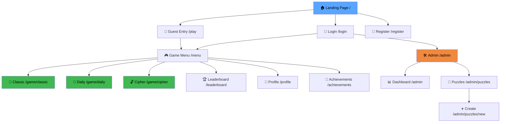
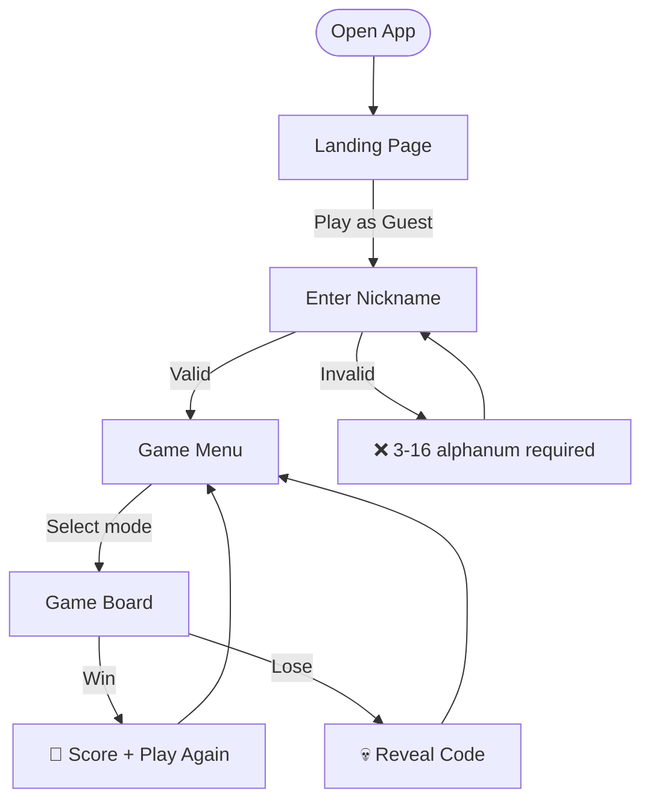
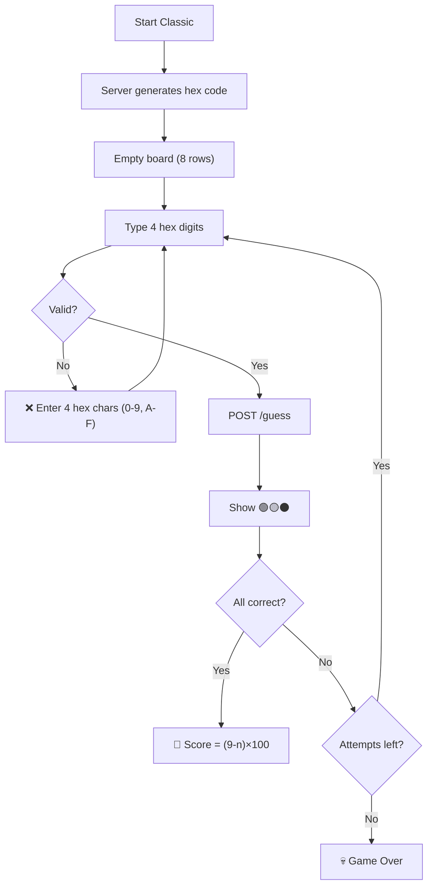
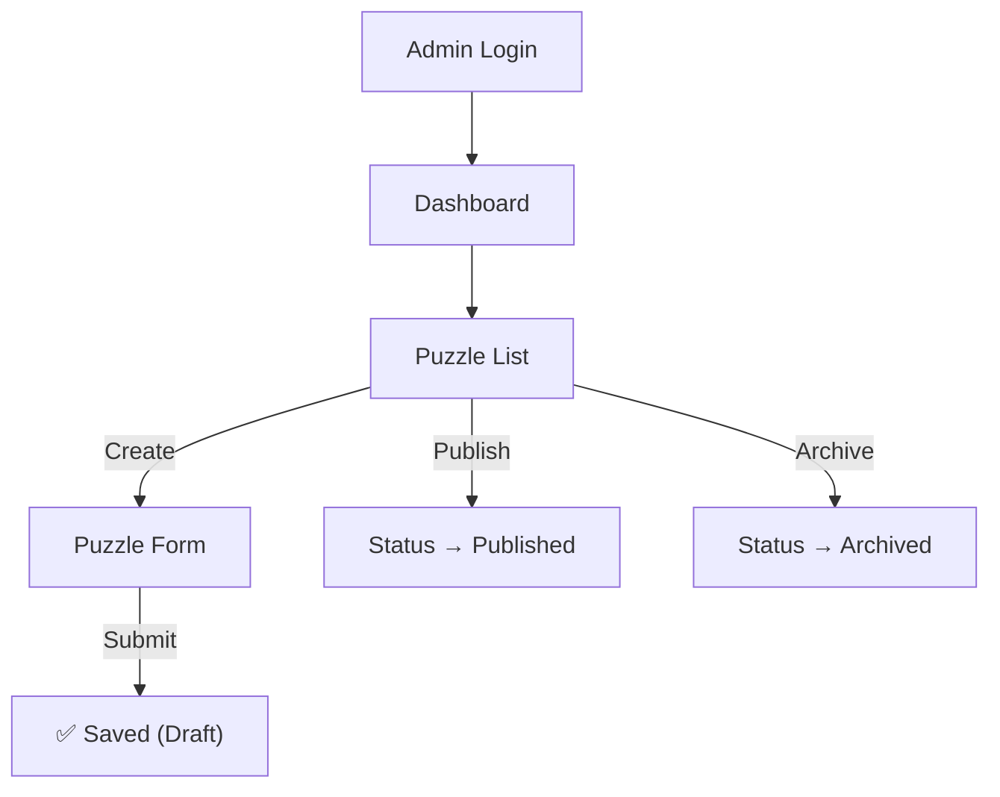

# 🎨 UI/UX Design Document — Code Breaker

> **Standar**: WCAG 2.1 AA | **Versi**: 1.0 | **Tanggal**: 17 April 2026

---

## 1. Design System

### 1.1 Color Palette (Dark Theme)

| Token               | Hex       | Usage                    | Contrast vs bg |
|----------------------|-----------|--------------------------|----------------|
| `--bg-primary`       | `#0D1117` | Page background          | —              |
| `--bg-secondary`     | `#161B22` | Card/panel bg            | —              |
| `--bg-tertiary`      | `#21262D` | Input fields, elevated   | —              |
| `--border`           | `#30363D` | Borders, dividers        | —              |
| `--text-primary`     | `#E6EDF3` | Primary text             | 13.5:1 ✅      |
| `--text-secondary`   | `#8B949E` | Muted text               | 5.3:1 ✅       |
| `--accent-green`     | `#3FB950` | Correct, success         | 5.8:1 ✅       |
| `--accent-yellow`    | `#D29922` | Misplaced, warning       | 4.6:1 ✅       |
| `--accent-red`       | `#F85149` | Wrong, error             | 5.1:1 ✅       |
| `--accent-blue`      | `#58A6FF` | Links, primary action    | 4.9:1 ✅       |
| `--accent-purple`    | `#A371F7` | XP, level, progression   | 4.5:1 ✅       |
| `--accent-orange`    | `#F0883E` | Admin, badges            | 4.8:1 ✅       |

### 1.2 Typography

| Token           | Font           | Weight | Size | Usage             |
|-----------------|----------------|--------|------|-------------------|
| `--font-display`| Inter          | 700    | 32px | Page titles       |
| `--font-heading`| Inter          | 600    | 24px | Section headings  |
| `--font-body`   | Inter          | 400    | 14px | Body text         |
| `--font-small`  | Inter          | 400    | 12px | Labels, captions  |
| `--font-mono`   | JetBrains Mono | 500    | 28px | Hex code display  |
| `--font-mono-sm`| JetBrains Mono | 500    | 18px | Hex input         |

### 1.3 Spacing & Radius

| Token     | Value | Token        | Value |
|-----------|-------|--------------|-------|
| `--sp-1`  | 4px   | `--radius-sm`| 4px   |
| `--sp-2`  | 8px   | `--radius-md`| 8px   |
| `--sp-3`  | 12px  | `--radius-lg`| 12px  |
| `--sp-4`  | 16px  | `--radius-xl`| 16px  |
| `--sp-5`  | 24px  | `--radius-full`| 9999px |
| `--sp-6`  | 32px  |              |       |

### 1.4 WCAG 2.1 AA Compliance

| Req     | Implementation                                              |
|---------|-------------------------------------------------------------|
| 1.4.1   | Feedback: warna + ikon (🟢🟡⚫) + teks label                |
| 1.4.3   | All text colors > 4.5:1 contrast ratio                      |
| 2.1.1   | Tab navigation, Enter to submit, focus indicators           |
| 2.4.7   | Blue outline on focused interactive elements                |
| 3.3.1   | Error messages: text + color + ⚠️ icon                      |
| 3.3.3   | Specific error suggestions ("Must be 4 hex chars")          |

### 1.5 Responsive Breakpoints

| Name     | Width         | Game Cell Size |
|----------|---------------|----------------|
| Mobile   | 320–639px     | 44px           |
| Tablet   | 640–1023px    | 52px           |
| Desktop  | 1024px+       | 56px           |

---

## 2. Sitemap

---

## 3. UX Flow Diagrams

### 3.1 Guest Play Flow

### 3.2 Classic Mode Flow

### 3.3 Admin Flow

---

## 4. Wireframe UI

> 📎 Lihat file: **[wireframe_ui.html](file:///d:/Computer%20Science%20UGM/Metode%20Rekayasa%20Perangkat%20Lunak/vibeCoding/docs/wireframe_ui.html)**
>
> Buka di browser untuk melihat wireframe interaktif semua halaman dengan error states.

> **Status: DRAFT**
