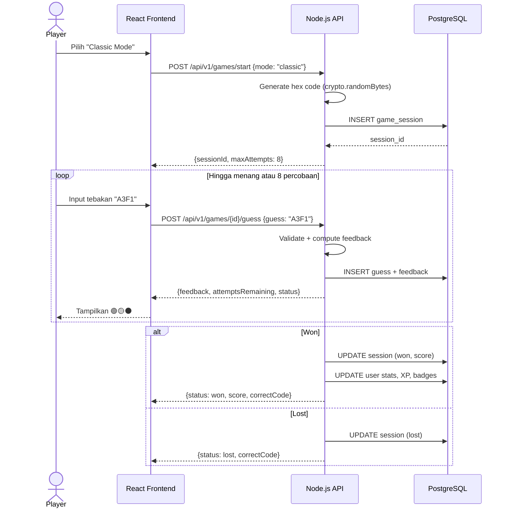
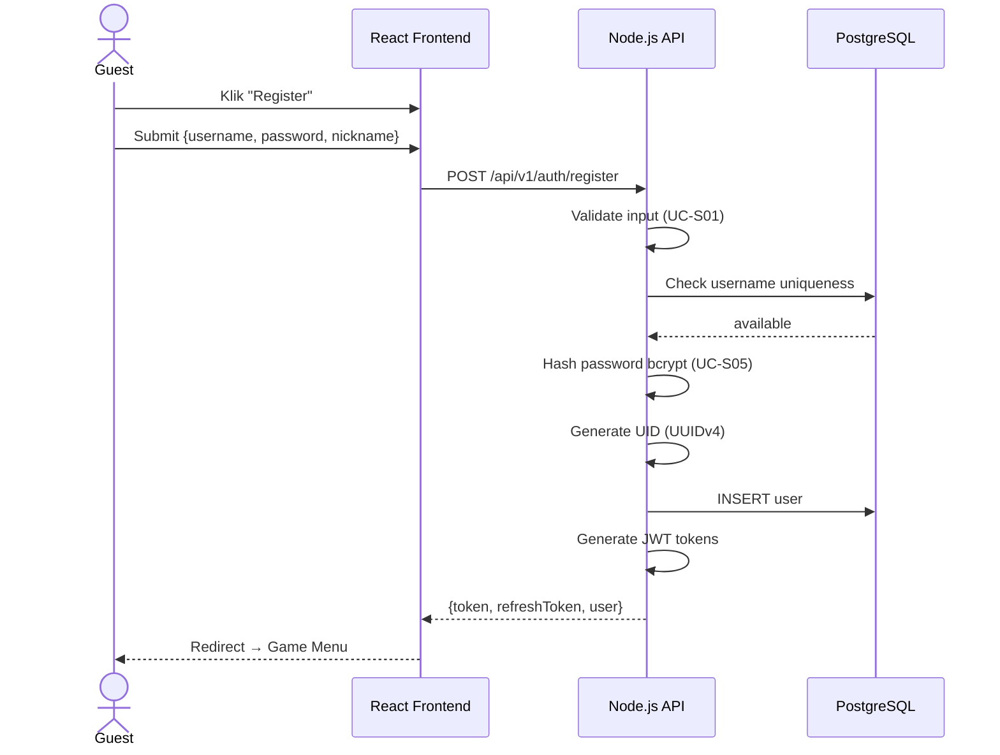
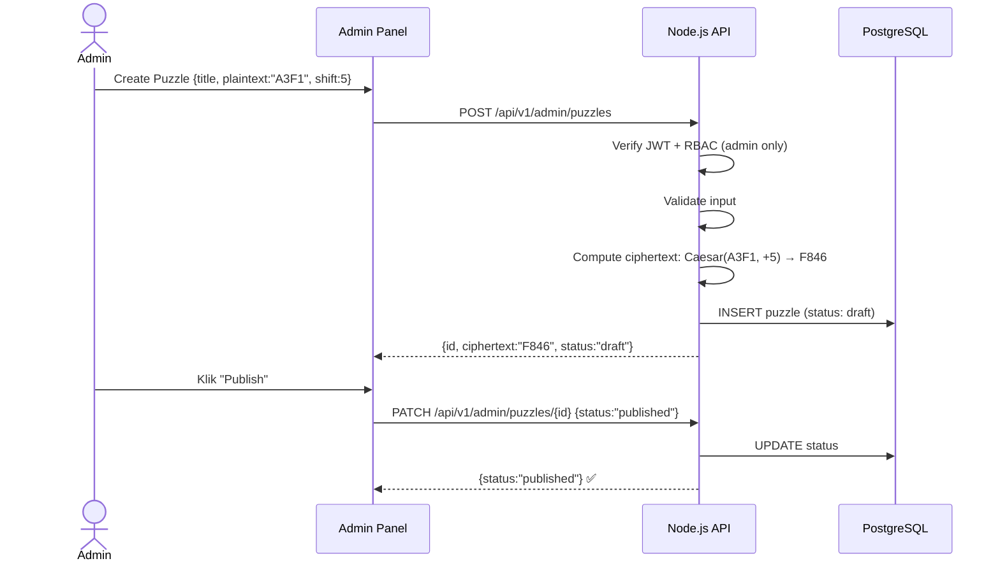

# 📋 Use Case Specification — Code Breaker

> **Standar Acuan**: IEEE 830 / Cockburn Use Case Template | **Versi**: 1.0 | **Tanggal**: 17 April 2026

---

## 1. Aktor

| Aktor              | Tipe      | Deskripsi                                                |
|---------------------|-----------|----------------------------------------------------------|
| **Guest Player**    | Primary   | Anonim, masukkan nickname. Skor tidak persisten.         |
| **Registered Player** | Primary | Terdaftar (username+password). Progres tersimpan.       |
| **Admin**           | Primary   | Pengelola konten puzzle Cipher Crack.                    |
| **System (Server)** | Supporting| Memproses logika game, autentikasi, validasi.            |

---

## 2. Ringkasan Use Case

| ID     | Nama                   | Aktor Utama       | Prioritas  |
|--------|------------------------|---------------------|------------|
| UC-01  | Enter Nickname         | Guest Player       | Must Have  |
| UC-02  | Register Account       | Guest Player       | Must Have  |
| UC-03  | Login                  | Registered / Admin | Must Have  |
| UC-04  | Logout                 | Registered / Admin | Must Have  |
| UC-05  | Update Profile         | Registered Player  | Should Have|
| UC-06  | Play Classic Mode      | Guest / Registered | Must Have  |
| UC-07  | Play Daily Challenge   | Guest / Registered | Must Have  |
| UC-08  | Play Cipher Crack      | Guest / Registered | Must Have  |
| UC-09  | Submit Guess           | Guest / Registered | Must Have  |
| UC-10  | View Leaderboard       | Guest / Registered | Must Have  |
| UC-11  | View Profile & Progress| Registered Player  | Must Have  |
| UC-12  | View Achievements      | Registered Player  | Should Have|
| UC-13  | Manage Cipher Puzzles  | Admin              | Must Have  |
| UC-14  | View Admin Dashboard   | Admin              | Should Have|

### Use Case Keamanan

| ID     | Nama                    | OWASP Ref           |
|--------|-------------------------|----------------------|
| UC-S01 | Validate & Sanitize Input | A03:2021 Injection |
| UC-S02 | Authenticate (JWT)      | A07:2021 Auth Failure|
| UC-S03 | Authorize (RBAC)        | A01:2021 Broken AC   |
| UC-S04 | Rate Limit Request      | A04:2021 Insecure Design |
| UC-S05 | Hash Password           | A07:2021 Auth Failure|
| UC-S06 | Generate Game Code      | A04:2021 Insecure Design |

---

## 3. Detail Use Case Fungsional

### UC-01: Enter Nickname (Anonymous Play)

| Field          | Detail                                                  |
|----------------|----------------------------------------------------------|
| **Aktor**      | Guest Player                                             |
| **Precondition** | Guest membuka aplikasi, belum punya sesi.              |
| **Postcondition**| Guest punya session token sementara.                   |
| **Trigger**    | Klik "Play as Guest".                                    |

**Main Flow:**
1. Guest membuka halaman utama.
2. Sistem tampilkan opsi "Play as Guest" dan "Login / Register".
3. Guest pilih "Play as Guest".
4. Sistem tampilkan form nickname.
5. Guest masukkan nickname (3–16 alfanumerik).
6. Sistem validasi format. *(include UC-S01)*
7. Sistem generate session token sementara.
8. Redirect ke Game Menu.

**Exception:** 5a. Nickname invalid → error "Nickname harus 3-16 karakter alfanumerik."

---

### UC-02: Register Account

| Field          | Detail                                                  |
|----------------|----------------------------------------------------------|
| **Aktor**      | Guest Player                                             |
| **Precondition** | Guest belum punya akun.                                |
| **Postcondition**| Akun tersimpan dengan UID (UUIDv4). JWT diberikan.     |

**Main Flow:**
1. Guest pilih "Register".
2. Sistem tampilkan form: Username, Password, Nickname.
3. Guest isi dan submit.
4. Sistem validasi input. *(include UC-S01)*
5. Sistem hash password. *(include UC-S05)*
6. Sistem generate UID (UUIDv4).
7. Simpan ke database. Generate JWT.
8. Redirect ke Game Menu.

**Exception:** 4a. Username duplikat → "Username sudah terdaftar." | 4b. Password < 8 char → error.

---

### UC-06: Play Classic Mode

| Field          | Detail                                                  |
|----------------|----------------------------------------------------------|
| **Aktor**      | Guest / Registered Player                                |
| **Precondition** | Player punya sesi aktif.                               |
| **Postcondition**| Game selesai, skor dicatat (jika Registered).           |

**Main Flow:**
1. Player pilih "Classic Mode".
2. Sistem generate kode hex 4-digit di server. *(include UC-S06)*
3. Sistem buat game session (max_attempts: 8).
4. Tampilkan board kosong.
5. Player masukkan tebakan. *(include UC-09)*
6. Sistem proses feedback.
7. Jika kode benar → status: won. Skor = (9 - attempts) × 100.
8. Jika percobaan habis → status: lost. Skor: 0.
9. Tampilkan result screen.
10. Jika Registered & win → update XP/stats/streak/badge.

---

### UC-08: Play Cipher Crack

**Main Flow:**
1. Player pilih "Cipher Crack". Sistem tampilkan daftar puzzle Published.
2. Player pilih puzzle. Sistem tampilkan ciphertext + info metode.
3. Player tebak plaintext hex 4-digit. *(include UC-09)*
4. Feedback: match/no-match per digit. Maks 6 percobaan.
5. Hint (jika ada) mengurangi skor 50%.

---

### UC-13: Manage Cipher Puzzles

| Field          | Detail                                                  |
|----------------|----------------------------------------------------------|
| **Aktor**      | Admin                                                    |
| **Precondition** | Admin sudah login. *(include UC-S02, UC-S03)*          |

**Main Flow — Create:**
1. Admin klik "Create New Puzzle".
2. Isi form: Title, Plaintext (4 hex), Shift Value, Hint (opsional).
3. Sistem validasi. *(include UC-S01)*
4. Sistem hitung ciphertext = Caesar(plaintext, shift) pada domain hex.
5. Simpan puzzle dengan status "Draft".

**Main Flow — Publish/Archive:**
1. Admin ubah status: Draft → Published → Archived.
2. Transisi mundur (Archived → Published) ditolak.

---

## 4. Use Case Keamanan (Detail)

### UC-S01: Validate & Sanitize Input
- Dipanggil oleh: UC-02, UC-03, UC-05, UC-09, UC-13
- Flow: Trim → validasi format (regex/length) → sanitize (escape HTML) → reject jika gagal (HTTP 400)

### UC-S02: Authenticate (JWT)
- Extract token dari `Authorization: Bearer <token>` → verify signature → check expiry → attach user ke request
- Gagal → HTTP 401

### UC-S03: Authorize (RBAC)
- Baca role dari token → bandingkan required role → reject jika tidak sesuai (HTTP 403)

### UC-S04: Rate Limit
- Login: 5 req/min/IP. Global: 100 req/min/IP. Exceed → HTTP 429 + Retry-After.

### UC-S05: Hash Password
- bcrypt (cost ≥ 10). Plaintext TIDAK pernah disimpan/di-log.

### UC-S06: Generate Game Code
- Classic: `crypto.randomBytes()`. Daily: `SHA256(date + secret)`. Cipher: dari DB.
- Kode TIDAK dikirim ke client.

---

## 5. Sequence Diagrams

### 5.1 Classic Mode — Full Gameplay

### 5.2 Registration Flow

### 5.3 Admin Manage Puzzle

---

## 6. Use Case Diagram

> 📎 Lihat file: **[use_case_diagram.html](file:///d:/Computer%20Science%20UGM/Metode%20Rekayasa%20Perangkat%20Lunak/vibeCoding/docs/use_case_diagram.html)**

> **Status: DRAFT — Siap untuk Review**
